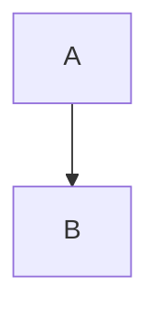

README.md 是使用MarkDown语法来编写的，下面介绍主要的使用格式 <br>

    1、标题   #
    2、列表   * 或 1.空格
    3、区块引用  >
    4、超链接、图片引用 [name](url)
    5、代码框          `code`  或```code``` + 语言
    6、粗体、斜体、删除线  * * *** ***  ~~ ~~
    7、华丽的分割线 ---
    8、表格   |col1|col2|
    9、流程图   mermaid
    10、复选框 - [x] 名称

---

1、标题
# 标题 1
## 标题 2
### 标题 3
###### 标题 6
---

2、列表
* 无序列表
* 无序列表
* 无序列表

1. 有序列表
2. 有序列表
3. 有序列表
> 数据后面，需要. 和空格

3、区块引用

> 一级引用
>> 二级引用
>>> 三级引用
>>>> 四级引用
>>>>> 五级引用


4、超链接、图片引用

[百度](http://www.baidu.com)

5、代码框

单行创建MyClass类
`public class MyClass{}`

多行创建MyClass类
```
public class MyClass{
    String name= "zhenyun.su"
}
```

高亮显示
``` java
public class MyClass{
    String name= "zhenyun.su"
}
```

 
6、粗体、斜体、删除线
 **粗体**
 ***斜体***
 ~~删除~~

7、华丽的分割线
---

8、表格

| name | age | date|
|-|-|-| 
| asu | 21 | 2018-04-17|
| liu | 25 | 2018-04-17|


9、流程图   mermaid

语法如下：
```
   mermaid
   graph 流程方向
   流程图内容
```
流程方法
1. TB 从上到下
2. BT 从下到上
3. RL 从右到左
4. LR 从左到右

基本图形
id + [文字描述]矩形
id + (文字描述)圆角矩形
id + >文字描述]不对称的矩形
id + {文字描述}菱形
id + ((文字描述))圆形

连接线
A --> B     A带箭头指向B
A --- B      A不带箭头指向B
A -.- B      A用虚线指向B
A -.-> B    A用带箭头的虚线指向B
A ==> B   A用加粗的箭头指向B
A -- 描述 --- B       A不带箭头指向B并在中间加上文字描述
A -- 描述 --> B      A带箭头指向B并在中间加上文字描述
A -. 描述 .-> B      A用带箭头的虚线指向B并在中间加上文字描述
A == 描述 ==> B  A用加粗的箭头指向B并在中间加上文字描述
。

TD 同TB

实例演示

从上到下



从右到左
```mermaid
graph RL
   id[A] --> (B)
```
从右到左
```mermaid
graph RL
   id[A] --> (B)
```
```mermaid
graph RL
   id((A)) -- 描述 --> {B}
   id1((A)) -- 描述 --> {C}
```
 
``` flow
st=>start :开始
op1=>operation: A
c=>condition: yes or no?
e=>end: 结束

st(right) ->op1(right)->c
```

``` seq
A->B: request
B<--A: response
```


10、复选框

- [x] 需求分析
- [ ] 交付


参考：
https://daringfireball.net/projects/markdown/syntax
